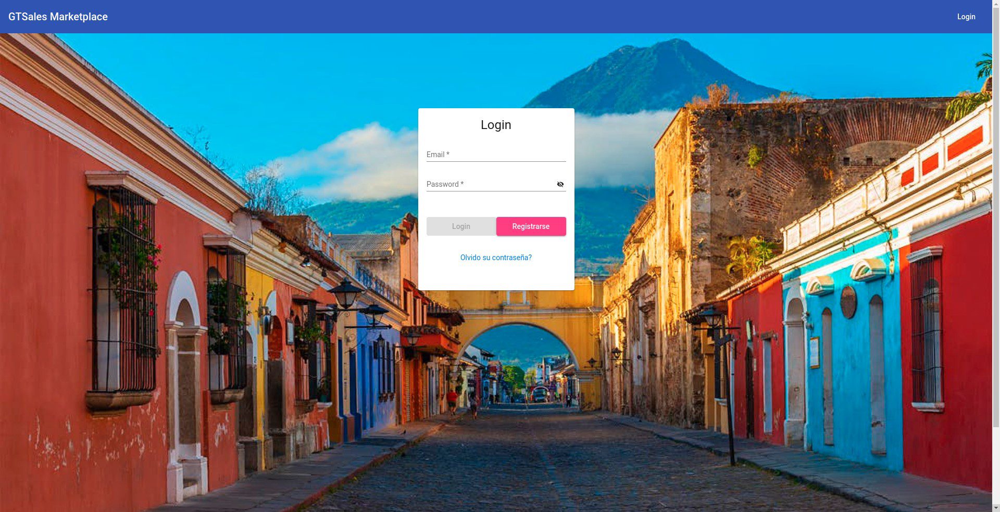

# GTMarketplace
## Table of contents
* [General info](#general-info)
* [Technologies](#technologies)
* [Setup](#setup)
* [Screenshots](#screenshots)

## General info
Website to sell and buy products created with Angular, it consumes an API created with NodeJs that connects to an Oracle database to obtain and add data (products, users, prices, etc..)

## Technologies
Project is created with:
* Angular
* Angular Material
* Nodejs
* OracleDB

	
## Setup
To run this project:

```
$ cd view
$ ng serve
```
## Screenshots

